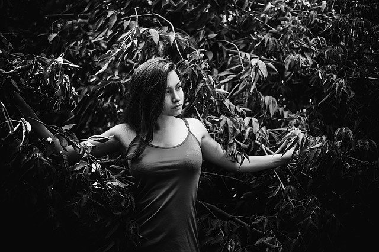
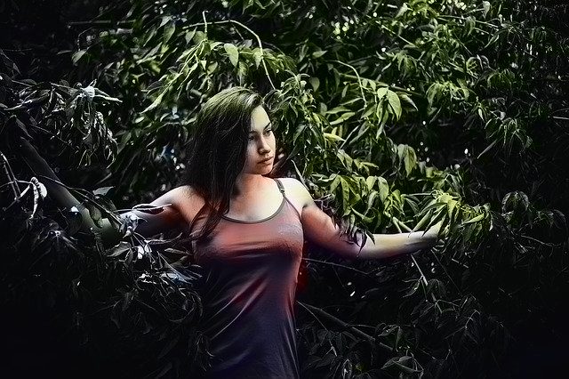

# BW-Image-Colorization-Deep-Learning
Deep Learning BW Image Colorization using pretrained caffe model.

Loading a pretrained network model with OpenCV DL library. I find it to work incrediby good. I would do a personal approach (thinking about a suitable GAN) someday soon.

The caffe model is missing because is too big, but is easy to find in the _internet_.
This is the result:

